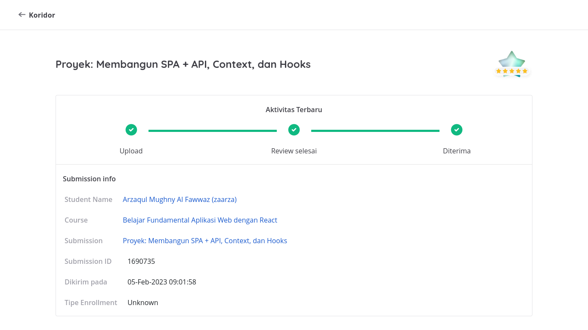
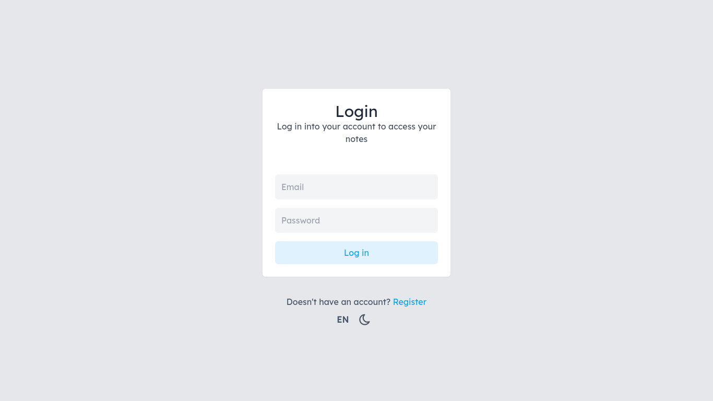
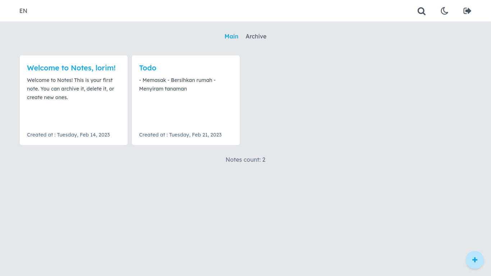
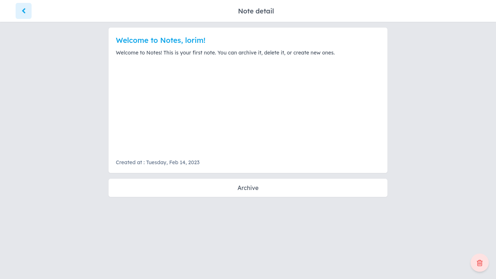
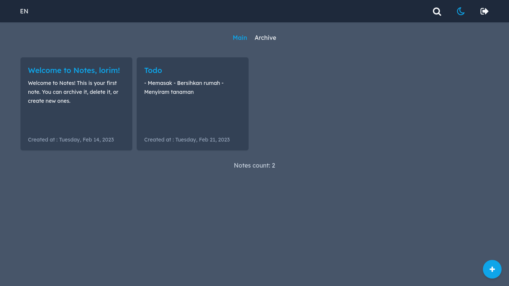

# Frontend Mentor - REST Countries API with color theme switcher solution

This is submission for Dicoding course "Belajar Fundamental Aplikasi Web dengan React"

## Criteria

### Main
- RESTful API as data source
- User register & authentication
- Only logged in user can access notes
- Toggle theme
- Using React hooks
- Fullfilled previous submission criteria

### Optional
- Show loading indicator
- Toggle language

## Overview

### Screenshot

### Links

- [Repository](https://github.com/zaarza/simple-note-app/)
- [Live preview](https://simple-note-app-zaarza.vercel.app/)

## My process

### Features
- Create new note
- Show all note
- Show detail note
- Archive & unarchive note
- Toggle dark mode
- Toggle language (English & Bahasa Indonesia)

### Framework / Library / Tools used

- React
- React Router Dom
- TailwindCSS
- Eslint

### Useful Resources

- Google Fonts
- Font Awesome

## Author

- Website - [Arzaqul Mughny Al Fawwaz](https://www.zaarza.github.io)
- Dicoding Profile - [Arzaqul Mughny Al Fawwaz](https://www.dicoding.com/users/zaarza/academies)

